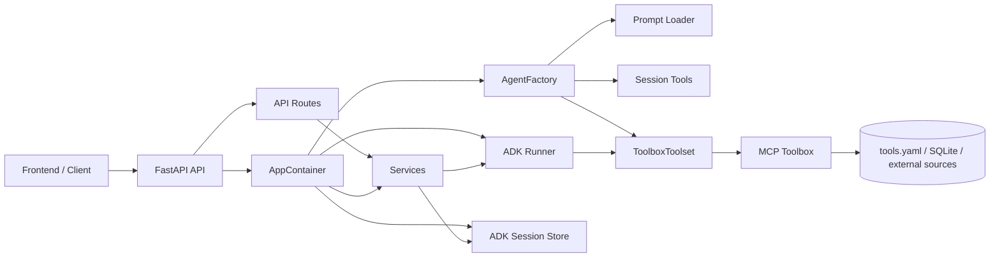

# 系統架構與設計 (Architecture & Design)

本文件描述目前保險推薦代理後端的實際模組切分、依賴方向與請求流程。

目前的設計目標是：

* 後端結構簡潔
* FastAPI 只負責 HTTP 邊界
* Agent 建立流程集中管理
* 業務邏輯集中在 service 層
* 工具與 prompt 保持獨立且可替換

---

## 一、目前目錄結構

目前後端核心目錄如下：

```text
app/
├── agent.py                 # ADK Agent 組裝入口與 prompt 載入
├── config.py                # 讀取環境變數與 runtime 設定
├── container.py             # 統一組裝 config、agent、session service 與 runner 等單例
├── session_state.py         # Session state key 與 UI 規則的契約定義
├── api/                     # FastAPI transport 層
│   ├── dependencies.py      # container 與 request-scoped 依賴取得
│   ├── main.py              # FastAPI app 建立、CORS 與 health endpoints
│   ├── schemas.py           # HTTP request/response 模型 (Pydantic)
│   └── routes/              # API 控制器
│       ├── run.py           # Agent run API 與 SSE 串流
│       └── sessions.py      # Session CRUD API
├── prompts/                 # Agent 核心提示詞
│   └── insurance_agent_prompt.txt
├── services/                # 業務流程與編排層
│   ├── agent_run_service.py # 執行 ADK runner 並轉為 API 傳輸的 envelope 格式
│   ├── readiness_service.py # 檢查 session store 與 toolbox 服務健康度
│   └── session_service.py   # 處理 session 查詢、建立、刪除與整理
└── tools/                   # 本地 ADK 工具
    └── session_tools.py     # 讀寫使用者 profile 與最近推薦狀態
```

### 模組關係圖



---

## 二、模組責任

### 1. config

`app/config.py` 負責：

* 讀取環境變數
* 建立 `AppRuntimeConfig`
* 提供 runtime 設定給 container、agent 與 services

這一層只處理設定，不負責任何業務流程。

---

### 2. container

`app/container.py` 是後端組裝中心，負責：

* 建立 ADK Agent
* 建立 session store
* 建立 ADK Runner
* 建立 session、agent run、readiness 等 services
* 聚合成 `AppContainer`

這一層只做依賴組裝，不承擔 HTTP 邏輯，也不承擔對話邏輯。

---

### 3. agent

`app/agent.py` 是正式且唯一的 Agent 建立入口，負責：

* 建立 `ToolboxToolset`
* 組合 session tools
* 建立 ADK Agent
* 提供 `AgentFactory` 與 `create_agent()`
* 載入 agent prompt 檔案

這樣 agent 建立邏輯維持在單一檔案，後續如果要替換 model、toolbox 或 prompt 載入策略，只需要改 `app/agent.py`。

---

### 4. api

`app/api/` 專注在 FastAPI 的 HTTP 邊界。

#### `main.py`
負責：
* 建立 FastAPI app
* 掛載 CORS
* 註冊 health/readiness endpoint
* 掛載 routes

#### `dependencies.py`
負責：
* 從 app state 或快取中取得 `AppContainer`
* 提供測試用 cache reset

#### `routes/run.py`
負責：
* `/api/agent/run` API
* 驗證 prompt 與 sessionId
* 轉呼叫 `AgentRunService`
* 回傳 SSE (Server-Sent Events) 串流

#### `routes/sessions.py`
負責：
* session list/create/delete API
* 轉呼叫 `SessionService`

#### `schemas.py`
負責：
* API request 與 response schema 結構定義

**切分原則**：
* API 層只做 request/response 格式化與 transport。
* API 層不直接承擔業務流程與狀態寫入。

---

### 5. services

`app/services/` 是主要業務邏輯層。

#### `session_service.py`
負責：
* 建立或查詢 session
* 刪除 session
* 整理 session list 給 API 使用
* 處理公開 state 與 UI state 過濾

#### `agent_run_service.py`
負責：
* 確保 session 存在
* 驅動 ADK Runner 執行
* 將 ADK event 轉換成 API 端所需的 envelope 格式（如 timeline、message、state、done 等）
* 合併 state patch

#### `readiness_service.py`
負責：
* 檢查 session store 是否可用
* 檢查 toolbox server 是否可連線

這層是目前後端的核心，所有與保險推薦 runtime 有關的整合邏輯都應優先放在 service，而不是 route。

---

### 6. tools

`app/tools/session_tools.py` 是註冊給 ADK Agent 的本地工具，負責：

* 讀取使用者 profile snapshot
* 寫入使用者 profile 到 session state
* 保存最後推薦商品
* 清除最後推薦商品

這些工具只處理 ADK 的 session state，不直接處理 HTTP 請求，也不涉及資料庫查詢。

---

### 7. prompts

`app/prompts/insurance_agent_prompt.txt` 定義 agent 的核心指令，負責：

* 對話策略
* 追問規則
* 工具選擇原則
* 推薦輸出格式與治理限制

Prompt 只負責行為約束與指令，不承擔任何程式組裝或 API 細節。

---

### 8. session_state

`app/session_state.py` 定義 session state key 的規則，負責：

* 使用者 profile key 清單（如 `user:age`, `user:budget`）
* 最後推薦商品 key 清單
* UI state key 規則

這個模組的目的是集中管理 state 契約，避免魔法字串散落在 service 與 tools 中。

---

## 三、請求流程

### 1. Session 管理流程

```text
HTTP Request (GET/POST/DELETE)
-> FastAPI Route (app/api/routes/sessions.py)
-> SessionService (app/services/session_service.py)
-> ADK Session Store (SQLite / DB)
-> JSON Response
```

說明：
* Route 負責驗證輸入與整理 HTTP 回應。
* SessionService 處理 session 查詢、過濾與底層操作。

---

### 2. Agent 執行流程

```text
HTTP POST /api/agent/run
-> API Route (app/api/routes/run.py)
-> AgentRunService (app/services/agent_run_service.py)
-> ADK Runner (google.adk.runners.Runner)
-> ADK Agent
-> Local Tools / ToolboxToolset
-> (Event Mapping)
-> SSE Response
```

執行順序細節：
1. 前端送出 prompt、sessionId、sessionState。
2. Route 驗證參數。
3. `AgentRunService` 確保 session 存在。
4. Runner 驅動 Agent 思考與呼叫工具。
5. Agent 依指示判斷需呼叫 `session_tools` 更新狀態，或呼叫 `ToolboxToolset` 取得外部保險資訊。
6. `AgentRunService` 將 ADK 事件（function calls, text generation, state patch）轉成對前端友好的 envelope 格式。
7. Route 透過 StreamingResponse 將事件以 SSE 傳回前端。

---

## 四、依賴方向

目前遵守的依賴方向如下：

```text
api -> services -> ADK/runtime integrations
container -> agent/services/config
agent -> prompts/tools/config
tools -> session_state
```

**限制原則**：
* Service 不能反向依賴 Container。
* Route 不承擔業務邏輯，只負責資料轉拋。
* API 不直接處理 ADK Session State 寫入的特定邏輯。
* Agent Factory 獨立於 FastAPI，以便支援 CLI 與評測 (eval) 獨立運行。

---

## 五、為什麼採用這種切分

### 1. 避免過多設計模式
專案沒有引入繁雜的 use case、repository 或 adapter 分層，而是維持簡單、扁平的分工，大幅降低學習成本與修改負擔。

### 2. 保持擴充彈性
當需要擴充新功能時，模組的職責十分明確：
* 新增 API 路徑：加在 `api/routes/`
* 修改對話策略：編輯 `prompts/`
* 新增推薦邏輯/外部查詢：擴充 `tools.yaml` 與 `Toolbox`
* 修改整合流程：加在 `services/`

### 3. 與 MCP Toolbox 的職責分離
FastAPI + services + agents 架構主要處理「對話與流程控制」，而「保險資料查詢能力」則委派給 MCP Toolbox。這確保了系統邊界：

* **FastAPI**：對前端的應用邊界。
* **ADK Agent**：對話與工具調度核心。
* **ToolboxToolset**：ADK 與 MCP 之間的橋樑。
* **MCP Toolbox & tools.yaml**：受控的外部資料庫查詢能力。

---

## 六、維護與擴充建議

1. **檔案收斂**：單一功能若只有一個檔案，無須過度拆分目錄。
2. **Route 只做轉換**：Route 只處理 HTTP 驗證、CORS、錯誤映射與 Streaming。
3. **Service 保持乾淨**：Service 應依賴注入的物件（如 config, runner, session store），不要直接使用全域 Container。
4. **Prompt 與 Tools 的獨立性**：不要讓 Prompt 與 Tool 被 FastAPI 的 context 污染，保持可在背景或 CLI 執行的純粹性。
