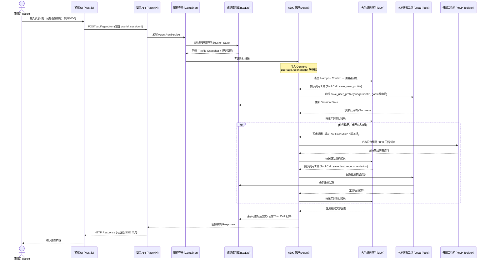

# 核心執行流程 (Core Flows)

<!-- Content from run.flow.md -->
# 使用者到工具呼叫完整流程說明與流程圖 (User to Tool Call Flow)

## 系統架構與流程概述

本保險推薦智能助理 (Insurance Recommendation Agent) 的核心設計理念，是透過前端 (Next.js) 與後端 (Python FastAPI + Google ADK) 的密切配合，實現具備「長效記憶」與「狀態追蹤」的多輪對話體驗。

當使用者在前端發送訊息時，系統會進行一系列的狀態解析、工具調用 (Tool Calling) 以及模型推論，最終返回合適的保險建議。以下將詳細拆解從使用者輸入到工具呼叫的完整流程。

---

## 完整互動流程說明

### 1. 前端請求發起 (Frontend Request)
* **起點**：使用者在前端網頁 (`adk-workbench.tsx` 或對話介面) 輸入訊息。
* **動作**：前端應用程式透過 Next.js 的 API Route (例如 `frontend/app/api/apps/[appName]/users/[userId]/sessions/[sessionId]/route.ts`) 封裝使用者的訊息、使用者 ID (User ID) 以及對話階段 ID (Session ID)。
* **傳輸**：前端將封裝好的 JSON Payload 透過 HTTP POST 請求發送至後端 FastAPI 伺服器的推論端點 (`/api/routes/run.py` 或類似的 Agent 執行端點)。

### 2. 後端請求接收與會話初始化 (Backend Receiving & Session Init)
* **接收**：FastAPI 應用程式接收到請求。
* **容器化服務**：透過 `AppContainer` (`app/container.py`)，系統實例化或取得對應的服務，包含 `AgentRunService`、`SessionService` 以及設定好的 `Agent` (`app/agent.py`)。
* **會話載入**：系統根據傳入的 Session ID，從資料庫 (由 `ADK_SESSION_DB_URI` 指定的 SQLite 或其他 DB) 中載入該次對話的歷史紀錄以及 **Session State (狀態快照)**。

### 3. 上下文注入與提示詞建構 (Context Injection & Prompting)
* **狀態讀取**：系統讀取 `app/session_state.py` 中定義的追蹤鍵值 (Tracked Profile State Keys)，例如 `user:age`, `user:budget`, `user:main_goal` 等。
* **上下文注入 (Inject Context)**：在將請求送交給 LLM (大型語言模型) 之前，系統會將已知的 User Profile 資料動態注入到 System Prompt 或對話上下文中。這樣可以確保模型「記住」使用者先前的資訊，避免重複詢問。

### 4. 模型推論與工具決策 (LLM Inference & Tool Decision)
* **模型思考**：LLM (如 gemini-3-flash-preview) 接收到包含系統提示詞、User Profile 快照以及最新使用者訊息的請求。
* **判斷意圖**：模型根據上下文與對話進度，判斷當前需要執行什麼動作：
  * **情境 A (缺少資訊)**：如果 Profile 尚未收集完整，模型決定直接回覆使用者，詢問缺失的資訊。
  * **情境 B (資訊更新)**：如果使用者提供了新的屬性（例如：「我預算改為 5000」），模型決定調用 `save_user_profile` 工具。
  * **情境 C (滿足推薦條件)**：如果 Profile 已足夠，模型決定調用 MCP (ToolboxToolset) 內的外部工具去搜尋保險產品。

### 5. 工具呼叫執行 (Tool Execution)
* **執行本地工具 (Local Tools)**：
  * `save_user_profile`：將使用者提供的新條件寫入 Session State。
  * `get_user_profile_snapshot`：主動獲取當前所有已知屬性（有時模型會主動調用以確認狀態）。
  * `save_last_recommendation`：將剛決定的推薦商品 ID 與名稱存入 State。
  * `clear_last_recommendation`：清除先前的推薦狀態。
* **執行外部工具 (MCP Toolbox)**：
  * 透過 `ToolboxToolset` (`protocol=Protocol.MCP_LATEST`)，向外部的 MCP 伺服器 (由 `TOOLBOX_SERVER_URL` 指定) 發起請求，例如查詢特定條件的保險產品資料庫。
* **結果回傳模型**：工具執行完畢後，執行結果 (例如：成功儲存狀態、外部資料庫的查詢結果) 會回傳給 LLM 進行二次推論。

### 6. 生成最終回覆與狀態持久化 (Response Generation & Persistence)
* **生成回覆**：LLM 根據工具回傳的結果，生成最終的人類易讀回覆（例如：「我已幫您將預算調整為 5000，並為您推薦以下產品...」）。
* **狀態儲存**：`SessionService` 將更新後的對話歷史 (包含 Tool Calls) 與 Session State 寫回資料庫 (`adk_sessions.db`)。
* **回傳前端**：FastAPI 將最終的文字回覆（可能包含 SSE 串流傳輸）回傳給 Next.js 前端，展示給使用者。

---

## 互動流程圖 (Mermaid Sequence Diagram)

---

<!-- Content from FLOW.md -->
# app 目錄流程說明

本文以 `app/` 目錄中的實際程式碼為主，整理兩條核心流程：

1. FastAPI 從啟動到完成初始化
2. 收到 `POST /api/agent/run` 到回傳結果

補充：FastAPI 真正的啟動命令定義在專案根目錄 `Makefile` 的 `run-fastapi`，會以 `uv run uvicorn app.api.main:app` 載入 `app/api/main.py` 內的 `app` 物件。雖然這個入口不在 `app/` 目錄內，但它是理解整條啟動鏈的起點。

## app 目錄角色總覽

`app/` 內各子模組在流程中的職責如下：

| 模組             | 主要檔案                                                                                                                             | 職責                                                            |
| ---------------- | ------------------------------------------------------------------------------------------------------------------------------------ | --------------------------------------------------------------- |
| API transport 層 | `app/api/main.py`, `app/api/routes/run.py`, `app/api/routes/sessions.py`, `app/api/schemas.py`                                       | 定義 FastAPI app、HTTP route、Pydantic request schema、SSE 輸出 |
| 依賴/容器        | `app/api/dependencies.py`, `app/core/container.py`, `app/core/config.py`, `app/app_runtime.py`                                       | 載入 runtime 設定、建立 container、提供 route 可取用的依賴      |
| Agent runtime    | `app/agent.py`                                                                                                                       | 建立 ADK `Agent`、載入 prompt、掛入工具                         |
| Application 層   | `app/application/agent_run_service.py`, `app/application/session_facade.py`, `app/application/health.py`                             | 將 route 需要的流程封裝成較穩定的應用服務                       |
| Session/狀態處理 | `app/api/session_service.py`, `app/api/presenters/session_presenter.py`, `app/domain/session_state.py`, `app/tools/session_tools.py` | 建立/查詢 session、整理 public state、維護 ADK state key 契約   |
| Event/SSE 轉換   | `app/api/streaming.py`, `app/api/mappers/adk_event_mapper.py`                                                                        | 把 ADK event 轉成前端可消化的 SSE envelopes                     |

---

## 情境一：FastAPI 啟動到完成整體初始化

### 流程總覽

1. ASGI server 載入 `app.api.main:app`。
2. `app/api/main.py` 在 module import 階段執行 `app = create_app()`。
3. `create_app()` 若沒收到外部 container，會呼叫 `build_app_container()` 建立整個 runtime graph。
4. `build_app_container()` 依序建立：
   - `AppRuntimeConfig`
   - ADK `Agent`
   - ADK `SessionService`
   - ADK `Runner`
   - `AppContainer`
5. `create_app()` 用這個 container 建立 FastAPI app、註冊 middleware、health endpoints 與 routes。
6. FastAPI 在 lifespan 啟動時，把 `app_container` 掛到 `app.state.container`。
7. 之後每個 request 都可以透過 `get_container(request)` 取得同一份 container。

### 詳細步驟

#### 1. 載入 FastAPI 入口

- 檔案：`app/api/main.py`
- 關鍵函數：`create_app(container: AppContainer | None = None) -> FastAPI`
- 關鍵 module-level 程式：`app = create_app()`

當 `uvicorn` 載入 `app.api.main:app` 時，Python 會 import `app/api/main.py`。這個檔案在最下方直接執行 `create_app()`，所以容器建立與 FastAPI app 建立都發生在 module import 階段，而不是等到第一個 request 才做。

#### 2. 建立應用容器 `AppContainer`

- 檔案：`app/core/container.py`
- 關鍵函數：
  - `_normalize_sqlite_db_path(session_db_uri: str) -> str`
  - `create_session_service(config: AppRuntimeConfig) -> BaseSessionService`
  - `create_runner(config, agent, session_service) -> Runner`
  - `build_app_container(config: AppRuntimeConfig | None = None) -> AppContainer`

`build_app_container()` 是初始化鏈的核心工廠。它做了以下事情：

1. 透過 `load_runtime_config()` 取得 `AppRuntimeConfig`
2. 透過 `create_agent(runtime_config)` 建立 ADK `Agent`
3. 透過 `create_session_service(runtime_config)` 建立 ADK session service
4. 透過 `create_runner(runtime_config, agent, session_service)` 建立 `Runner`
5. 把上述物件組成不可變的 `AppContainer`

這表示 route 層不用自己知道怎麼建 agent、runner 或 session service，只要拿 container 即可。

#### 3. 載入 runtime 設定

- 檔案：`app/core/config.py`
- 關鍵型別與函數：
  - `AppRuntimeConfig`
  - `load_runtime_config() -> AppRuntimeConfig`
  - `_parse_bool_env()`
  - `_parse_csv_env()`
- 轉出入口：`app/app_runtime.py`

`load_runtime_config()` 會從環境變數組出整份 runtime 設定，內容包括：

- `app_name`
- `api_user_id`
- `toolbox_server_url`
- `session_db_uri`
- `memory_mode`
- `model_name`
- `fastapi_host`
- `fastapi_port`
- `fastapi_reload`
- `cors_allow_origins`

這份設定同時被 agent、session service、runner 與 FastAPI CORS 設定共用，是整個初始化鏈的共同輸入。

#### 4. 建立 ADK Agent

- 檔案：`app/agent.py`
- 關鍵函數：
  - `load_prompt() -> str`
  - `create_agent(config: AppRuntimeConfig | None = None)`
- 關鍵 module-level 物件：`APP_CONFIG`, `root_agent`

`create_agent()` 會做三件事：

1. 透過 `load_prompt()` 讀取 `app/prompts/insurance_agent_prompt.txt`
2. 建立 `ToolboxToolset(server_url=runtime_config.toolbox_server_url, protocol=Protocol.MCP)`
3. 建立 ADK `Agent(...)`

Agent 掛入的工具有：

- `get_user_profile_snapshot`
- `save_user_profile`
- `save_last_recommendation`
- `clear_last_recommendation`
- `toolbox`

前四個工具來自 `app/tools/session_tools.py`，負責直接讀寫 ADK session state；`toolbox` 則會連到外部 Toolbox MCP server。

#### 5. 建立 SessionService

- 檔案：`app/core/container.py`
- 關鍵函數：`create_session_service(config)`

`create_session_service()` 依 `session_db_uri` 決定 session backend：

- 如果 URI scheme 是 `sqlite`，就建立 `SqliteSessionService`
- 否則建立 `DatabaseSessionService`

若是 SQLite，會先走 `_normalize_sqlite_db_path()` 把 `sqlite+aiosqlite:///./db/adk_sessions.db` 這種 URI 轉成底層 service 可接受的 db path。

#### 6. 建立 Runner

- 檔案：`app/core/container.py`
- 關鍵函數：`create_runner(config, agent, session_service) -> Runner`

`Runner` 是 route 真正用來執行 agent 的 runtime 入口。它被初始化為：

- `app_name=config.app_name`
- `agent=agent`
- `session_service=session_service`

因此後續每次 `run_async()` 執行時，都會共享同一套 app 名稱、agent 與 session storage。

#### 7. 建立 FastAPI app 本體

- 檔案：`app/api/main.py`
- 關鍵函數：`create_app()`

拿到 `app_container` 後，`create_app()` 會繼續：

1. 宣告 `lifespan()`
   - 在啟動階段執行 `app.state.container = app_container`
   - 這一步是 request 期依賴注入的關鍵
2. 建立 `FastAPI(...)`
3. 呼叫 `app.add_middleware(CORSMiddleware, ...)`
4. 宣告 `/healthz`
5. 宣告 `/readyz`
6. `app.include_router(session_router)`
7. `app.include_router(run_router)`

#### 8. Health 與 Ready 的初始化角色

- 檔案：`app/api/main.py`, `app/application/health.py`
- 關鍵函數：
  - `healthz()`
  - `readyz(request: Request)`
  - `ReadinessService.collect_errors()`

這兩個 endpoint 雖然不是啟動流程本身，但它們反映初始化結果：

- `/healthz` 只回報 app 基本存活
- `/readyz` 會真的讀取 container 並檢查：
  - `session_service` 是否可取得
  - `toolbox_server_url` 是否能被 `requests.get()` 連通

如果 `collect_errors()` 有錯，會回 `503 not_ready`；沒有錯則代表 runtime 元件已可服務。

#### 9. Request 期間的依賴解析方式

- 檔案：`app/api/dependencies.py`
- 關鍵函數：
  - `_get_cached_container()`
  - `get_container(request: Request | None = None) -> AppContainer`
  - `get_runtime_config()`
  - `get_agent()`
  - `get_session_service()`
  - `get_runner()`
  - `reset_dependency_caches()`

`get_container()` 有兩條路徑：

1. 一般正式請求：從 `request.app.state.container` 取回 lifespan 已掛好的 container
2. 沒有 request 可用時：走 `_get_cached_container()`，用 `lru_cache` 延遲建立一份 cached container

這個 fallback 對測試與非 request 情境很重要，也解釋了為什麼部分程式碼可以在沒有 FastAPI request context 時仍能工作。

### 情境一總結

FastAPI 初始化的真正控制中心是 `build_app_container()` + `create_app()`：

- `build_app_container()` 負責把 runtime 元件建齊
- `create_app()` 負責把 runtime 元件掛進 FastAPI
- `lifespan()` 負責把 container 放進 `app.state`
- `dependencies.py` 負責讓 route 在 request 期間取回這份 container

---

## 情境二：收到使用者呼叫 API `run` 到回傳結果

### 流程總覽

1. Client 對 `POST /api/agent/run` 送出 `prompt`、`sessionId`、`sessionState`
2. FastAPI 先用 `AgentRunRequest` 做 request schema 驗證
3. `run_agent()` 取得 container、session facade、runner，並確保 session 存在
4. `AgentRunService.stream()` 呼叫 `Runner.run_async()` 執行 ADK agent
5. ADK 逐步吐出 event
6. `adk_event_mapper` 把 event 轉成前端可讀 envelopes
7. `encode_sse_event()` 把 envelopes 包成 SSE frame
8. `StreamingResponse` 持續把資料送回 client
9. 結束時補一個 `done` envelope；若執行中失敗則補 `error` envelope

### Request/Response 契約

- route 檔案：`app/api/routes/run.py`
- schema 檔案：`app/api/schemas.py`
- 請求模型：`AgentRunRequest`

`AgentRunRequest` 定義：

- `prompt: str`
- `sessionId: str`
- `sessionState: dict[str, str] = {}`

這是 FastAPI 第一層的資料驗證；若型別不符合，FastAPI 會直接回 422，還不會進到 `run_agent()`。

### 詳細步驟

#### 1. route 進入點 `run_agent()`

- 檔案：`app/api/routes/run.py`
- 關鍵函數：
  - `get_runner(request: Request | None = None)`
  - `run_agent(payload: AgentRunRequest, request: Request)`

`run_agent()` 的第一步是把輸入正規化：

1. `prompt = payload.prompt.strip()`
2. `session_id = payload.sessionId.strip()`

如果 trim 後任一欄位為空字串，就直接回：

- HTTP 400
- JSON: `{"error": "prompt and sessionId are required"}`

這是 route 自己補上的第二層驗證，專門處理「原始字串有內容但 trim 後是空白」的情況。

#### 2. 取得 container 與 application services

- 檔案：`app/api/routes/run.py`
- 涉及函數：
  - `get_container(request)`
  - `SessionFacade(container.session_service, container.config)`
  - `get_runner(request)`

`run_agent()` 會先拿到 `container`，然後建出兩個 request 專屬服務：

1. `SessionFacade`
   - 包裝 session CRUD / state 讀取
2. `AgentRunService`
   - 包裝 agent 執行與 SSE envelope 流

其中 `runner` 取得方式有一個特別處理：

- 先呼叫 `get_runner(request)`
- 若遇到 `TypeError`，就退回 `get_runner()`

這是為了兼容測試時 monkeypatch 後只接受零參數的替身函數。

#### 3. 先確保 session 存在

- 檔案：`app/application/agent_run_service.py`
- 關鍵函數：`AgentRunService.ensure_session()`
- 往下委派到：
  - `app/application/session_facade.py` 的 `SessionFacade.ensure_session()`
  - `app/api/session_service.py` 的 `create_session_if_missing()`

呼叫鏈如下：

1. `run_agent()` 呼叫 `await run_service.ensure_session(session_id, payload.sessionState)`
2. `AgentRunService.ensure_session()` 直接委派給 `SessionFacade.ensure_session()`
3. `SessionFacade.ensure_session()` 再委派給 `create_session_if_missing(...)`
4. `create_session_if_missing()` 先做 `session_service.get_session(...)`
5. 如果 session 已存在，直接回 existing session
6. 如果不存在，呼叫 `session_service.create_session(...)`，並把 `payload.sessionState` 當成初始 state 寫入

如果這一步失敗，route 直接回：

- HTTP 502
- JSON: `{"error": "Unable to ensure session: ..."}`

也就是說，在任何 SSE 串流開始之前，session 一定會先被建立好。

#### 4. 建立 SSE generator

- 檔案：`app/api/routes/run.py`
- 關鍵程式：
  - `normalized_payload = payload.model_copy(...)`
  - `sse_generator()`
  - `StreamingResponse(...)`

session 確認完成後，`run_agent()` 會：

1. 用 `payload.model_copy(update={...})` 建立 trim 後的新 payload
2. 宣告內部 async generator `sse_generator()`
3. 在 generator 中迭代 `run_service.stream(normalized_payload)`
4. 每拿到一個 envelope，就用 `encode_sse_event(envelope)` 轉成 `data: ...\n\n`
5. 最後回傳 `StreamingResponse(media_type="text/event-stream", ...)`

這裡的 HTTP response headers 也被固定成 SSE 適合的形式：

- `Cache-Control: no-cache, no-transform`
- `Connection: keep-alive`

#### 5. `AgentRunService.stream()` 啟動 ADK 執行

- 檔案：`app/application/agent_run_service.py`
- 關鍵函數：`AgentRunService.stream()`

`stream()` 是真正串接 ADK 與前端 SSE 格式的地方。初始化時它會先準備：

- `sequence = 0`
- `current_text = ""`
- `merged_state = dict(request.sessionState)`

接著立刻先送出第一個 envelope：

- `yield build_meta_envelope()`

這代表 client 一收到 SSE，就會先看到 transport 層說明，而不是等 ADK 第一個 event 才有資料。

#### 6. 包裝 user prompt 成 ADK message

- 檔案：`app/api/streaming.py`
- 關鍵函數：
  - `build_user_message_content(prompt: str) -> genai_types.Content`
  - `iter_run_events(...)`

`AgentRunService.stream()` 會呼叫：

`iter_run_events(self._runner, user_id=..., session_id=..., prompt=..., state_delta=request.sessionState)`

`iter_run_events()` 內部做的是：

1. `build_user_message_content(prompt)` 把字串包成 ADK 需要的 `Content(role="user", parts=[Part(text=prompt)])`
2. 呼叫 `runner.run_async(...)`

實際傳給 ADK `Runner` 的參數是：

- `user_id=self._config.api_user_id`
- `session_id=session_id`
- `new_message=build_user_message_content(prompt)`
- `state_delta=request.sessionState or None`

所以這次請求不只送出新訊息，也把前端傳來的 `sessionState` 一併作為本次 run 的 state delta。

#### 7. Runner 執行 Agent 與工具

- 主要檔案：`app/core/container.py`, `app/agent.py`, `app/tools/session_tools.py`
- 關鍵物件/函數：
  - `create_runner()`
  - `create_agent()`
  - `get_user_profile_snapshot()`
  - `save_user_profile()`
  - `save_last_recommendation()`
  - `clear_last_recommendation()`

當 `runner.run_async()` 執行時，實際跑的是初始化階段建立好的 ADK `Agent`。這個 agent：

1. 依照 `insurance_agent_prompt.txt` 的指示推理
2. 需要讀寫使用者 profile 時，呼叫 `session_tools.py` 內的函數
3. 需要查保險商品或外部資料時，透過 `ToolboxToolset` 連到 MCP toolbox server

其中 `session_tools.py` 對 ADK state 的直接影響如下：

- `get_user_profile_snapshot()` 讀取 `TRACKED_PROFILE_STATE_KEYS`
- `save_user_profile()` 更新 `user:*` 狀態欄位
- `save_last_recommendation()` 寫入最後推薦商品資訊
- `clear_last_recommendation()` 刪除最後推薦商品資訊

因此後面看到的 `state` envelope，通常就來自 agent 執行過程中的這些工具操作，或其他 ADK state delta 更新。

#### 8. 過濾與映射 ADK events

- 檔案：
  - `app/application/agent_run_service.py`
  - `app/api/mappers/adk_event_mapper.py`
  - `app/api/streaming.py`
- 關鍵函數：
  - `is_echoed_user_input(event, prompt)`
  - `map_adk_event_to_envelopes(event, sequence)`
  - `merge_state_patches(current_state, envelopes)`

每收到一個 ADK event，`AgentRunService.stream()` 都會這樣處理：

1. 先用 `is_echoed_user_input(event, prompt)` 判斷是不是 ADK 把使用者原文回吐
   - 如果是，就 `continue`
2. `sequence += 1`
3. 呼叫 `map_adk_event_to_envelopes(event, sequence)`
4. 呼叫 `merge_state_patches(merged_state, envelopes)` 更新目前累積的 state
5. 逐一 `yield envelope`

`map_adk_event_to_envelopes()` 會依 event 內容拆成不同 envelope：

- `function_call` -> `timeline` / `kind="tool-call"`
- `function_response` -> `timeline` / `kind="tool-result"`
- agent partial text -> `timeline(kind="stream")` + `message(mode="append")`
- agent final text -> `timeline(kind="agent")` + `message(mode="replace")`
- `event.actions.state_delta` -> `timeline(kind="state")` + `state(patch=...)`

這一步是整個 `run` API 對前端最重要的轉譯層，因為前端最終收到的不是原始 ADK event，而是這套統一 envelope 格式。

#### 9. 維護 `current_text` 與狀態合併

- 檔案：`app/application/agent_run_service.py`

在逐一輸出 envelope 的同時，`stream()` 還會維護兩個內部累積值：

1. `current_text`
   - 若 envelope 是 `message` 且 `mode == "append"`，就把文字接在後面
   - 若 envelope 是 `message` 且 `mode == "replace"`，就把目前文字整段覆蓋掉
2. `merged_state`
   - 由 `merge_state_patches()` 持續把所有 `state` envelope 的 patch 合進來

這樣在串流結束時，就能拿到：

- 最終顯示文字
- 過程中累積後的最新 state

#### 10. 串流結束後補 `done` envelope

- 檔案：`app/application/agent_run_service.py`
- 往下委派到：
  - `app/application/session_facade.py` 的 `get_state()`
  - `app/api/session_service.py` 的 `get_session_state()`
  - `app/api/presenters/session_presenter.py` 的 `build_public_state()`
  - `app/domain/session_state.py` 的 `is_ui_state_key()`

ADK event stream 結束後，`AgentRunService.stream()` 不會直接用記憶體中的 `merged_state` 當最終答案，而是會再查一次 session storage：

1. `final_state = await self._sessions.get_state(session_id=session_id, fallback_state=merged_state)`
2. `SessionFacade.get_state()` 委派給 `get_session_state()`
3. `get_session_state()` 呼叫 `session_service.get_session(...)`
4. 若 session 存在，會把 `session.state` 丟進 `build_public_state()`
5. `build_public_state()` 會濾掉 `_ui_` 開頭的 key
6. 若有 `fallback_state`，回傳 `{**persisted_state, **fallback_state}`

最後再組出：

- `build_done_envelope(final_text=..., state=final_state)`

若 `current_text` 為空，還會回預設訊息：

`ADK runtime 已完成執行，請查看右側 event history。`

#### 11. SSE 實際輸出格式

- 檔案：`app/api/streaming.py`
- 關鍵函數：
  - `build_meta_envelope()`
  - `build_done_envelope()`
  - `build_error_envelope()`
  - `encode_sse_event()`

每個 envelope 最後都會被 `encode_sse_event()` 轉成：

`data: <json>\n\n`

因此 client 端收到的是標準 SSE frame。常見 envelope 類型包括：

- `meta`
- `timeline`
- `message`
- `state`
- `done`
- `error`

#### 12. 錯誤路徑

`run` API 的錯誤分成三層：

1. Request schema 不符
   - FastAPI 直接回 422
2. Route 前置檢查失敗
   - 空白 `prompt/sessionId` -> 400 JSON
   - `ensure_session()` 失敗 -> 502 JSON
3. ADK 執行中才失敗
   - `AgentRunService.stream()` 的 `except Exception as exc` 會 `yield build_error_envelope(str(exc))`
   - 這時 HTTP status 通常仍是 200，因為 SSE response 已建立，但串流尾端會收到 `error` envelope

### 情境二總結

`POST /api/agent/run` 的控制中心不是 route 本身，而是三層協作：

- `run.py`：HTTP 驗證、組裝 SSE response
- `agent_run_service.py`：調用 Runner、累積文字與 state、控制串流生命周期
- `streaming.py` + `adk_event_mapper.py`：把 ADK event 轉成前端契約

換句話說，真正的資料流是：

Client request
-> `AgentRunRequest`
-> `run_agent()`
-> `SessionFacade.ensure_session()`
-> `Runner.run_async()`
-> ADK Agent / Tools / Toolbox
-> `map_adk_event_to_envelopes()`
-> `encode_sse_event()`
-> `StreamingResponse`

---

## 兩個情境的關聯

這兩條流程其實共用同一組核心物件：

1. 啟動時，`build_app_container()` 先把 `config / agent / session_service / runner` 建好
2. request 來時，`get_container(request)` 把這些物件取回來
3. `run` route 只是把已初始化好的 runtime 元件接進 request lifecycle

因此如果要排查問題，可以優先用下面方式定位：

- 啟動就失敗：先看 `app/core/config.py`, `app/core/container.py`, `app/agent.py`
- `/readyz` 不通：再看 `app/application/health.py`
- `/api/agent/run` 前置失敗：看 `app/api/routes/run.py`, `app/api/session_service.py`
- SSE 內容不對：看 `app/application/agent_run_service.py`, `app/api/streaming.py`, `app/api/mappers/adk_event_mapper.py`
- state 不對：看 `app/tools/session_tools.py`, `app/api/presenters/session_presenter.py`, `app/domain/session_state.py`

---

