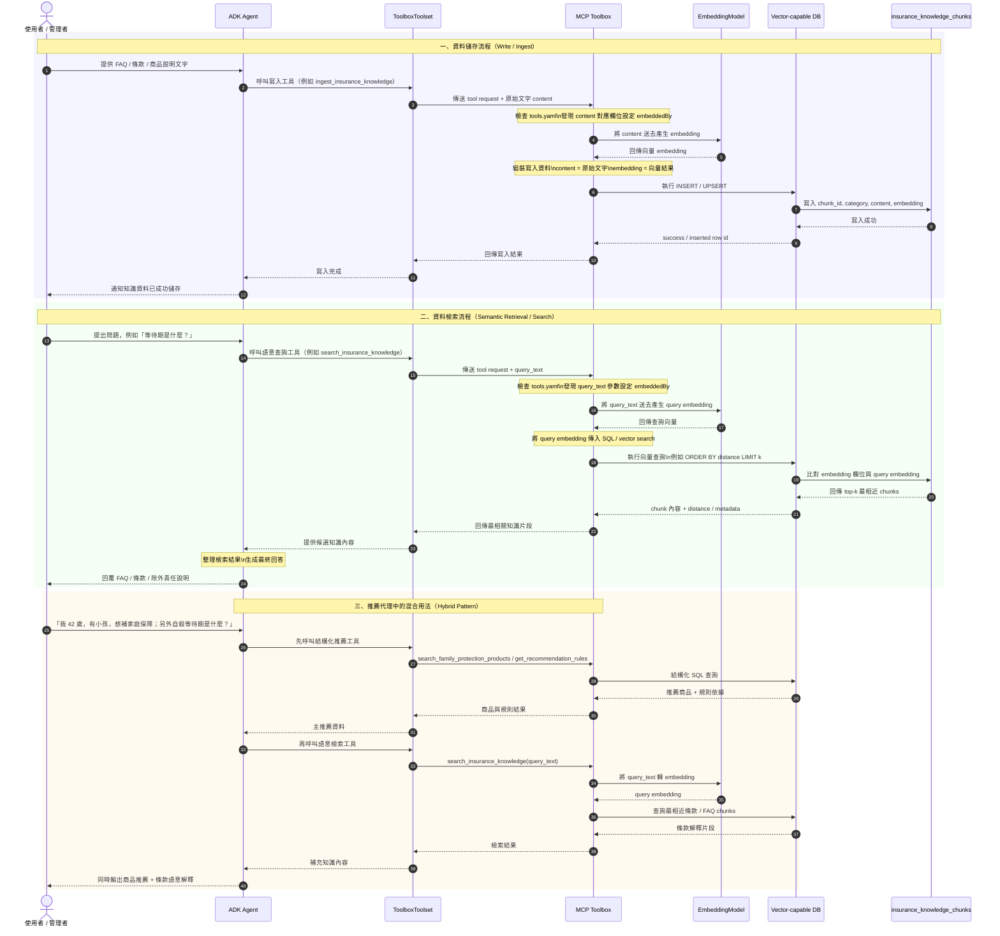
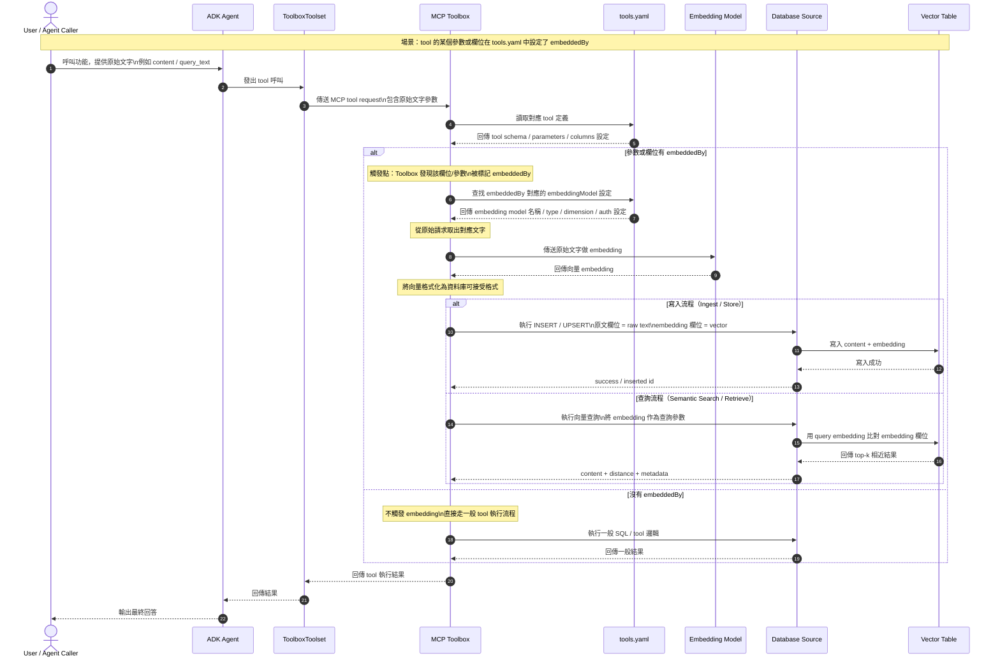

# 代理設計與治理 (Agent Design & Governance)

<!-- Content from prompt_tool_contract.md -->
# Prompt 與 Tool 分工契約（Prompt / Tool Contract）

本文件說明本專案中 **Google ADK Agent Prompt** 與 **MCP Toolbox Tools** 的責任邊界、分工原則，以及兩者如何協作完成保險推薦流程。

這份文件的目的，是避免 Agent 與 Tool 的責任混淆，讓整個系統更容易：

- 維護
- 測試
- 擴充
- 降低風險

---

## 一、核心原則

本專案採用以下分工原則：

- **Prompt 負責決策與解釋**
- **Tool 負責受控資料存取**
- **Prompt 不直接自由查資料**
- **Tool 不負責最終推薦話術**

也就是說：

> **Agent 負責思考與表達，Toolbox 負責受控執行。**

---

## 二、Prompt 的責任

在本專案中，ADK Agent Prompt 的責任包括：

### 1. 判斷資訊是否足夠
Agent 需要先判斷是否已取得以下必要資訊：

- 年齡
- 預算
- 主要保障目標

若資訊不足，Agent 應先追問，而不是直接推薦商品。

---

### 2. 決定要使用哪一個工具
Prompt 需要根據使用者需求，決定對應的保險專用工具，例如：

- `medical` -> `search_medical_products`
- `accident` -> `search_accident_products`
- `family_protection` -> `search_family_protection_products`
- `income_protection` -> `search_income_protection_products`
- `life` -> `search_family_protection_products`

Prompt 的責任是**選工具**，不是自己實作查詢邏輯。

---

### 3. 解釋工具輸出
Agent 會根據工具回傳的內容，產生最終推薦結果，例如：

- 為什麼推薦這個商品
- 這個商品適合哪類情境
- 有哪些限制
- 有哪些等待期或除外條款
- 哪條規則支撐這次推薦

---

### 4. 控制輸出語氣與風險
Prompt 需要確保最終回答：

- 不虛構資料
- 不承諾保證核保
- 不承諾保證理賠
- 不承諾保證收益
- 保留保守聲明

---

### 5. 整理最終回答格式
Prompt 應控制回覆具備基本結構，例如：

- 使用者需求摘要
- 推薦商品名稱
- 推薦原因
- 條件限制
- 等待期與除外條款
- 規則依據
- 保守聲明

---

## 三、Tool 的責任

本專案中的 MCP Toolbox Tools 負責：

### 1. 提供受控資料查詢能力
Tools 的工作是執行已定義的查詢邏輯，而不是讓 Agent 任意查資料庫。

例如：

- 查符合醫療保障條件的商品
- 查符合家庭保障條件的商品
- 查商品詳細資訊
- 查推薦規則

---

### 2. 回傳結構化資料
Tool 應回傳穩定、可預期的資料結構，例如：

- 商品 ID
- 商品名稱
- 商品類型
- 保費範圍
- 保障摘要
- 等待期
- 除外條款
- 推薦規則

Tool 不應負責最終自然語言包裝。

---

### 3. 維持查詢邏輯的可測試性
由於 Tool 是受控查詢，因此可以獨立驗證：

- 查詢條件是否正確
- 映射是否正確
- SQL 是否穩定
- 回傳格式是否穩定

這讓整個系統比自由 SQL 更容易測試。

---

### 4. 限制行為邊界
Tool 的責任不是「盡可能回答任何問題」，而是：

- 僅在定義範圍內返回資料
- 保持查詢能力清楚
- 避免變成無限制的資料庫入口

---

## 四、目前工具對照表

本專案目前在 `tools.yaml` 中定義的保險工具如下：

### 1. `search_medical_products`
用途：
- 依年齡與預算搜尋醫療保障商品

---

### 2. `search_accident_products`
用途：
- 依年齡與預算搜尋意外保障商品

---

### 3. `search_family_protection_products`
用途：
- 依年齡與預算搜尋家庭保障商品
- 目前主要對應壽險類商品

---

### 4. `search_income_protection_products`
用途：
- 依年齡與預算搜尋收入中斷保障商品
- 目前優先回傳重大疾病與壽險候選商品

---

### 5. `get_product_detail`
用途：
- 查詢單一商品的詳細資料
- 補充等待期、除外條款、年齡範圍與商品摘要

---

### 6. `get_recommendation_rules`
用途：
- 查詢推薦規則
- 補充「為何推薦」的規則依據

---

## 五、Prompt 與 Tool 的邊界定義

### Prompt 不應做的事
Prompt 不應：

- 任意產生 SQL
- 假設資料庫中存在某商品
- 自己捏造等待期、除外條款、規則內容
- 將推理結果誤當作資料事實

---

### Tool 不應做的事
Tool 不應：

- 直接輸出最終推薦話術
- 自己做保守聲明判斷
- 決定最終語氣
- 模擬核保或理賠判斷
- 越界回答超出定義範圍的問題

---

## 六、目前的映射契約

在目前專案中，保障目標與工具選擇的映射如下：

| 使用者保障目標 | Agent 應優先選擇的工具 |
|---|---|
| medical | `search_medical_products` |
| accident | `search_accident_products` |
| family_protection | `search_family_protection_products` |
| income_protection | `search_income_protection_products` |
| life | `search_family_protection_products` |

這個映射屬於 **Prompt 的決策責任**，而不是由 Tool 自行猜測。

---

## 七、典型互動流程

### 情境 A：資訊不足
使用者輸入：

> 我想買保險，幫我推薦。

此時 Prompt 應：

1. 判斷資訊不足
2. 不呼叫推薦工具
3. 先追問：
   - 年齡
   - 預算
   - 主要保障目標

此時 Tool 不應被呼叫。

---

### 情境 B：醫療保障
使用者輸入：

> 我 30 歲，年度保險預算 15000，想加強醫療保障。

此時 Prompt 應：

1. 判斷資訊足夠
2. 選擇 `search_medical_products`
3. 視需要選擇 `get_product_detail`
4. 整理推薦回覆

---

### 情境 C：家庭保障
使用者輸入：

> 我 42 歲，已婚有小孩，年度預算 30000，想補家庭保障。

此時 Prompt 應：

1. 判斷資訊足夠
2. 選擇 `search_family_protection_products`
3. 選擇 `get_recommendation_rules`
4. 視需要選擇 `get_product_detail`
5. 整理推薦回覆

---

## 八、為什麼不讓 Agent 自由產生 SQL

這是本專案最重要的設計原則之一。

若讓 Agent 自由產生 SQL，會有以下問題：

### 1. 安全風險
模型可能查詢不必要的欄位或資料。

### 2. 查詢不穩定
同樣需求可能產生不同 SQL，難以維護與測試。

### 3. 難以驗證
你會很難界定是 Prompt 問題、Tool 問題，還是 SQL 本身問題。

### 4. 工具責任模糊
當模型同時負責選工具、寫 SQL、整理結果時，系統變得不易維護。

因此，本專案採用：

- **YAML 定義受控工具**
- **Prompt 負責決策**
- **Toolbox 負責執行**

這樣的架構更清楚也更穩定。

---

## 九、目前的保守輸出契約

所有最終推薦回覆都應遵守以下輸出原則：

### 必須包含
- 推薦商品名稱
- 推薦原因
- 若有條件限制需提醒
- 若有等待期或除外條款需說明
- 保守聲明

### 不可包含
- 保證核保
- 保證理賠
- 保證收益
- 模型自行捏造的商品資訊

### 固定保守聲明
所有推薦回覆最後應包含：

> 本建議僅供初步商品篩選，實際投保仍需以商品條款、健康告知與核保結果為準。

---

## 十、未來擴充時的分工原則

未來若擴充新能力，仍應維持同樣邊界：

### 若是資料查詢或檢索能力
應優先考慮放進 Toolbox，例如：

- FAQ semantic retrieval
- 條款檢索
- 進階商品搜尋

### 若是對話決策與話術控制
應優先放在 Agent Prompt，例如：

- 追問順序
- 推薦話術
- 保守聲明策略
- 規則解釋方式

---

## 十一、結論

本專案的 Prompt / Tool Contract 可以濃縮成一句話：

> **Prompt 決定怎麼問、怎麼選、怎麼說；Tool 決定怎麼查、查什麼、回什麼。**

透過這樣的分工：

- Agent 能保持靈活
- Tool 能保持受控
- 系統更容易測試與維護
- 後續更容易擴充到 embedding、FAQ retrieval、正式資料源與 production 架構

---

<!-- Content from memory.md -->
五、Memory 設計原則
原則 1：只記穩定、可重用的資訊

像：

「我通常看家庭保障」
「我已婚有小孩」
「我目前有公司團保」

這些適合進 memory。

原則 2：不要把一次性訊息全丟進 memory

像：

「今天只想看 2 個候選」
「先不要講重大疾病險」

這種比較偏當次 session。

原則 3：memory 拿來做「候選背景」，不是絕對真相

所以 agent 第一輪應說：

「我目前記得您之前偏家庭保障，若這次條件相同我就延續；若有變動再告訴我。」

---

<!-- Content from embedding.md -->
## Embedding 設計與目前結構化工具設計的差異

下面用表格整理 **目前設計** 與 **加入 embedding 設計** 的功能差異，並附上保險推薦代理的實際範例。

目前你的專案是以 **`tools.yaml + ToolboxToolset + 結構化 SQL tools`** 為主；這很適合做年齡、預算、保障目標、規則依據這類明確條件的推薦。MCP Toolbox 官方配置也把 `source`、`tool`、`toolset`、`prompt` 視為核心配置能力；另外也保留了 `embeddingModels` 與向量／檢索相關能力，適合延伸到語意搜尋與知識輔助場景。

| 面向                 | 目前設計：結構化工具 / SQL 型                | embedding 設計：語意檢索 / 向量型            | 保險代理範例                                                                                           |
| ------------------ | --------------------------------- | ---------------------------------- | ------------------------------------------------------------------------------------------------ |
| 核心目的               | 依明確條件做**可控篩選**                    | 依語意相似度做**相關內容召回**                  | 目前：依年齡 42、預算 30000、家庭保障找壽險；embedding：找「最像家庭責任保障」的條款或 FAQ 片段                                      |
| 最適合處理的問題           | 年齡、預算、商品類型、規則優先級這類**硬條件**         | 用戶自然語言問題、模糊需求、條款解釋、FAQ 問答這類**軟語意** | 目前：`search_family_protection_products`；embedding：搜尋「家庭責任、房貸、小孩教育費」相關知識片段                         |
| 推薦商品主流程            | 很適合當主流程                           | 不建議單獨當主流程                          | 主推薦仍應由 SQL tool 決定可投保候選；embedding 可輔助解釋為何這商品適合                                                   |
| 對輸入格式要求            | 較高，需要明確欄位                         | 較低，可接受模糊句子                         | 目前要知道 age / budget / goal；embedding 可處理「我怕突然生病影響家庭收入」                                            |
| 可解釋性               | 高，因為可回溯到 SQL 條件與規則表               | 中等，因為是相似度召回，需額外說明來源                | 目前可說「因為 age、budget、goal 符合」；embedding 可說「找到最相關 FAQ/條款」                                           |
| 結果穩定性              | 高                                 | 中到高，取決於 chunk、embedding model、檢索策略 | 同樣輸入，SQL 篩選通常更穩；embedding 可能因文本切分不同而有差異                                                          |
| 安全邊界               | 容易收斂，因為工具輸入輸出固定                   | 需多做內容治理，避免召回不相關或過時片段               | 目前只回指定欄位；embedding 可能召回不該優先展示的條文                                                                 |
| 最佳資料來源             | 結構化資料表                            | FAQ、條款、說明文件、長文本                    | `insurance_products` / `recommendation_rules` 適合目前設計；`faq_knowledge`、條款文件適合 embedding            |
| 與 MCP Toolbox 配置對應 | `source` + `tool` + `toolset` 已足夠 | 需要再用到 `embeddingModels` 與向量／檢索相關能力 | 目前你的 `tools.yaml` 已成熟；embedding 是下一層擴充方向                                                         |
| trace 與除錯          | 容易，因為看到明確 tool call 即可            | 較複雜，還要看檢索片段、相似度、chunk 命中           | 目前 trace 很清楚：`search_family_protection_products` → `get_recommendation_rules`；embedding 還要多看召回片段 |
| 典型輸出               | 商品候選、細節、規則依據                      | FAQ 答案、條款摘要、相關段落                   | 目前輸出「家庭定期壽險方案 C」；embedding 輸出「自殺等待期」或「既往症」相關說明                                                   |
| 是否需要大改既有架構         | 不需要，已完成                           | 不必推翻，只要加一層輔助工具                     | 建議保留現有主流程，embedding 只增強問答與說明                                                                     |
| 專案成熟度角色            | 主幹                                | 第二階段加值模組                           | 現在已可 demo；embedding 讓 demo 更像「懂條款的顧問」                                                            |

---

## 用保險代理來看，兩種設計最直觀的差異

| 使用情境          | 目前設計更適合 | embedding 設計更適合 | 例子                             |
| ------------- | ------- | --------------- | ------------------------------ |
| 找符合條件的商品      | 是       | 否               | 「我 30 歲，預算 15000，想加強醫療保障」      |
| 判斷是否符合年齡 / 預算 | 是       | 否               | 「42 歲、30000 預算是否能買家庭保障商品」      |
| 根據規則給主推薦      | 是       | 否               | 「有小孩優先考慮壽險」                    |
| 回答模糊問題        | 一般      | 是               | 「哪種保險比較像在保家庭生活不要中斷？」           |
| FAQ 問答        | 一般      | 是               | 「醫療險和意外險差在哪？」                  |
| 條款或除外責任說明     | 一般      | 是               | 「等待期是什麼？既往症會怎樣？」               |
| 找相似商品說明       | 一般      | 是               | 「有沒有跟家庭定期壽險方案 C 類似但更偏收入保障的內容？」 |
| 推薦後補充解釋       | 可做      | 很適合             | 推薦後再補「自殺等待期」「未誠實告知」相關條文說明      |

---

## 建議的最終分工

| 層次          | 建議使用         | 功能                                 |
| ----------- | ------------ | ---------------------------------- |
| 主推薦層        | 目前設計         | 根據 age / budget / goal / rules 選商品 |
| 商品細節層       | 目前設計         | 查等待期、除外條款、保費範圍                     |
| 規則解釋層       | 目前設計         | 說明為何家庭保障優先壽險                       |
| FAQ / 條款問答層 | embedding 設計 | 回答模糊問題、條款差異、名詞解釋                   |
| 推薦後知識增強層    | embedding 設計 | 推薦商品後補充最相關 FAQ / 條款片段              |

---

## 具體範例對照

| 使用者問題                        | 目前設計會怎麼做                                                                    | embedding 設計可額外做什麼                 |
| ---------------------------- | --------------------------------------------------------------------------- | ---------------------------------- |
| 我 42 歲，已婚有小孩，預算 30000，想補家庭保障 | 用 `search_family_protection_products` 找商品，再用 `get_recommendation_rules` 補原因 | 再補充「家庭責任」「收入中斷」相關 FAQ 或條款摘要        |
| 我想買保險，幫我推薦                   | 先追問 age / budget / goal                                                     | 可理解模糊語氣，補問時更像顧問，例如先猜可能在意醫療、意外或家庭責任 |
| 醫療險跟意外險差在哪                   | 可以硬查 FAQ 表，但表達較死                                                            | 用語意檢索找最相關 FAQ 片段，回答更自然             |
| 等待期是什麼意思                     | 若有明確 FAQ 表可回                                                                | 很適合，用條款 / FAQ chunks 做語意檢索後摘要      |
| 這張壽險適不適合我現在有房貸的情況            | 目前可依 family protection 規則回答                                                 | 還可檢索「房貸、家庭支柱、收入中斷」相關知識片段輔助說明       |

---

## Embedding 時序圖

## Embedding 向量處理流程

## 結論

| 判斷                  | 建議                               |
| ------------------- | -------------------------------- |
| 主推薦引擎               | 繼續用你現在的 `tools.yaml` 結構化工具       |
| embedding 是否值得加     | 值得，但作為第二階段的**知識檢索增強**            |
| 最適合先加的 embedding 功能 | FAQ 語意檢索、條款 / 除外責任語意檢索           |
| 不建議先做的事             | 用 embedding 取代年齡 / 預算 / 目標的主篩選邏輯 |

---

<!-- Content from governance.md -->
# 治理

本文件定義了保險推薦代理專案的責任邊界、變更所有權和 CI 驗證規則。

該專案基於以下技術構建：
- Google ADK 進行代理編排
- MCP Toolbox 用於伺服器端工具和提示配置
- `tools.yaml` 作為配置中心
- SQLite 作為示例資料來源

## 架構責任模型

### 1. ADK 提示
**位置**
- `app/prompts/insurance_agent_prompt.txt`

**責任**
- 控制對話流程
- 決定何時詢問後續問題
- 決定何時呼叫工具
- 根據使用者意圖選擇正確的工具
- 決定何時透過規則或產品詳情豐富答案
- 執行高層級護欄

**應包含**
- 必要資訊檢查
- 工具選擇邏輯
- 推薦工作流程規則
- 安全約束
- 非虛構規則

**不應包含**
- SQL 陳述式
- 硬編碼的產品事實
- 繁重的回應格式化範本
- 資料庫特定邏輯

**變更影響**
- 影響代理行為和工具選擇

---

### 2. Toolbox 工具
**位置**
- `db/tools.yaml`

**責任**
- 執行受控資料檢索
- 返回產品候選項
- 返回產品詳情
- 返回推薦規則

**目前的工具**
- `search_medical_products`
- `search_accident_products`
- `search_family_protection_products`
- `search_income_protection_products`
- `get_product_detail`
- `get_recommendation_rules`

**應包含**
- 結構化的基於 SQL 的檢索邏輯
- 受控的輸入參數
- 穩定的輸出欄位

**不應包含**
- 對話策略
- 完整的推薦措辭
- 合規免責聲明
- 自由格式的推理文本

**變更影響**
- 影響檢索品質和推薦證據

---

### 3. Toolbox 工具集
**位置**
- `db/tools.yaml`

**責任**
- 為不同的使用案例分組工具

**目前的工具集**
- `insurance_recommendation_tools`
- `insurance_debug_tools`

**應包含**
- 按操作目的進行清晰分組
- 推薦工具與調試工具分離

**不應包含**
- 無意圖的重複或混合目的分組

**變更影響**
- 影響哪些工具對代理或環境可見

---

### 4. Toolbox 提示
**位置**
- `db/tools.yaml`

**責任**
- 提供可重用的提示範本
- 標準化後續問題措辭
- 標準化推薦輸出結構
- 標準化免責聲明措辭

**目前的提示**
- `insurance_followup_question_template`
- `insurance_recommendation_response_template`
- `insurance_disclaimer_template`

**應包含**
- 後續問題範本
- 推薦回應範本
- 合規免責聲明範本

**不應包含**
- SQL 邏輯
- 工具選擇規則
- 資料庫映射邏輯

**變更影響**
- 影響一致性、措辭和合規表達

---

### 5. 資料庫結構描述和種子資料
**位置**
- `db/schema.sql`
- `db/seed.sql`

**責任**
- 儲存產品資料
- 儲存推薦規則
- 儲存常見問題和示例資料

**應包含**
- 保險產品
- 推薦規則
- 常見問題知識
- 示例使用者設定檔

**不應包含**
- 代理編排邏輯
- 提示範本
- 執行時對話規則

**變更影響**
- 影響工具可以檢索的內容

---

## 所有權模型

| 角色 | 擁有 | 典型變更 |
|---|---|---|
| 代理工程師 | ADK 提示、代理流程 | 後續邏輯、工具選擇邏輯、編排更新 |
| 資料/平台工程師 | Toolbox 工具、工具集、來源配置 | SQL 工具、配置結構、工具分組 |
| 領域所有者 / 產品經理 / 合規 | Toolbox 提示 | 措辭、免責聲明、推薦回應結構 |
| 資料庫所有者 | 結構描述、種子資料、產品記錄 | 產品資料、規則、常見問題、示例記錄 |

---

## 變更控制規則

### ADK 提示變更
使用時機：
- 對話流程需要調整
- 工具選擇規則需要改進
- 安全或編排行為需要更新

### Toolbox 工具變更
使用時機：
- 檢索邏輯有誤
- 產品篩選需要改進
- 新增推薦場景

### Toolbox 提示變更
使用時機：
- 後續問題措辭需要修訂
- 輸出格式必須更加一致
- 合規措辭必須更新

### 資料庫變更
使用時機：
- 產品目錄變更
- 規則內容變更
- 常見問題或示例資料變更

---

## CI 驗證檢查清單

## 階段 1：Toolbox 配置驗證
目標：確認 `tools.yaml` 可載入且完整。

### 通過條件
- `Initialized 1 sources: insurance_sqlite`
- `Initialized 6 tools: ...`
- `Initialized 3 toolsets: ...`
- `Initialized 3 prompts: ...`
- `Server ready to serve!`

### 失敗條件
- YAML 結構描述錯誤
- 工具計數不匹配
- 提示計數不匹配
- 來源初始化失敗

---

## 階段 2：工具契約驗證
目標：確認每個工具返回預期的資料邊界。

### `search_medical_products`
輸入：
- `age=30`
- `budget=15000`

預期：
- 返回 `安心住院醫療方案 A`
- 不返回非醫療產品

### `search_family_protection_products`
輸入：
- `age=42`
- `budget=30000`

預期：
- 返回 `家庭定期壽險方案 C`

### `search_income_protection_products`
輸入：
- `age=38`
- `budget=25000`

預期：
- 返回合理的收入保護候選項
- 在可用時優先考慮 `critical_illness`，其次是 `life` 產品

### `get_product_detail`
輸入：
- `product_id=3`

預期：
- 包括等待期
- 包括除外責任
- 包括保費範圍
- 包括年齡範圍

### `get_recommendation_rules`
輸入：
- `main_goal=family_protection`

預期：
- 返回家庭責任相關規則

---

## 階段 3：提示契約驗證
目標：確認可重用範本仍滿足業務和合規要求。

### `insurance_followup_question_template`
必須仍詢問：
- 年齡
- 預算
- 主要保護目標

不得：
- 直接推薦產品
- 編造產品資訊

### `insurance_recommendation_response_template`
必須仍要求：
- 產品名稱
- 推薦原因
- 條件提醒
- 等待期 / 除外責任摘要
- 無虛構內容
- 無承保、理賠或回報保證

### `insurance_disclaimer_template`
必須仍包含完整的免責聲明含義，不得省略。

---

## 階段 4：代理整合驗證
目標：確認 ADK + ToolboxToolset + `tools.yaml` 正確配合。

### 案例 A：醫療保護
輸入：
`我 30 歲，年度保險預算 15000，想加強醫療保障，有什麼推薦？`

預期：
- 追蹤包括 `search_medical_products`
- 可能包括 `get_product_detail`
- 推薦 `安心住院醫療方案 A`
- 包括免責聲明

### 案例 B：資訊不完整
輸入：
`我想買保險，幫我推薦。`

預期：
- 無產品搜尋工具呼叫
- 詢問年齡、預算和主要目標

### 案例 C：家庭保護
輸入：
`我 42 歲，已婚有小孩，年度預算 30000，想補家庭保障。`

預期：
- 追蹤包括 `search_family_protection_products`
- 追蹤包括 `get_recommendation_rules`
- 推薦 `家庭定期壽險方案 C`
- 包括免責聲明

### 案例 D：低預算意外保險
輸入：
`我 27 歲，年度預算 8000，想先補意外保障。`

預期：
- 追蹤包括 `search_accident_products`
- 優先選擇較低進入的產品
- 包括除外責任提醒

### 案例 E：收入保護
輸入：
`我 38 歲，已婚有小孩，年度預算 25000，想加強收入中斷風險保障。`

預期：
- 追蹤包括 `search_income_protection_products`
- 可能包括 `get_recommendation_rules`
- 不虛構不可用的產品

### 案例 F：沒有精確匹配
輸入：
`我 68 歲，年度預算 10000，想加強醫療保障。`

預期：
- 清楚說明可能沒有精確匹配
- 不虛構產品
- 可能保守地提供最接近的候選項

---

## 階段 5：發布閘門
如果發生以下任何情況，必須阻止發布：
- Toolbox 配置無法初始化
- 缺少必要工具
- 缺少必要提示
- 免責聲明要求被破壞
- 高優先級整合案例失敗
- 代理虛構產品或規則內容

---

## 操作原則

1. **ADK 提示控制流程**
   - 決定何時詢問
   - 決定何時搜尋
   - 決定呼叫哪個工具

2. **Toolbox 工具控制資料存取**
   - 檢索結構化的產品和規則資訊
   - 不擁有對話行為

3. **Toolbox 提示控制措辭契約**
   - 標準化後續提示
   - 標準化推薦輸出
   - 標準化合規免責聲明

4. **CI 確保這些層不會偏離**
   - 配置驗證
   - 工具驗證
   - 提示驗證
   - 整合驗證

---

## 建議的審查工作流程

1. 僅更新相關層
   - ADK 提示用於編排
   - Toolbox 工具用於檢索
   - Toolbox 提示用於措辭
   - 資料庫用於資料

2. 執行本地驗證
   - Toolbox 啟動檢查
   - 工具煙霧測試
   - 提示契約檢查
   - 代理場景測試

3. 以變更類別開啟拉取請求
   - `agent-flow`
   - `tool-config`
   - `prompt-template`
   - `data-update`

4. 要求適當所有者批准

---

## 治理基本原則

**ADK 提示管理流程，Toolbox 工具管理資料，Toolbox 提示管理措辭契約，CI 驗證所有三者保持對齊。**

---

